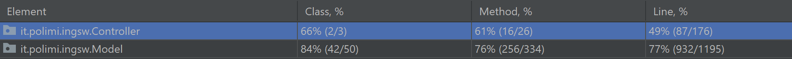

# Masters of Renaissance
**Final project of "Software Engineering" AY 2020-2021.**

**Professor**: Prof. Gianpaolo Cugola

**Group**: GC15

####Team Members:
* [Domenico Putignano](https://github.com/domenicoputignano) 
* [Piero Rendina](https://github.com/PieroRendina) 
* [Andrea Restelli](https://github.com/andrearestelli)

##Implemented features
| Feature | Status |
| ------- | ------ |
| Complete rules | :heavy_check_mark: |
| Socket | :heavy_check_mark: |
| CLI | :heavy_check_mark: |
| GUI | :heavy_check_mark: |
| Multiple matches | :heavy_check_mark: |
| Disconnection resilience | :heavy_check_mark: |
| Local game | :heavy_check_mark: | 

## Requirements
* [Java SE 11 or higher](https://docs.oracle.com/en/java/javase/11/)
* [Maven (optional)](https://maven.apache.org/download.cgi)

## Build
You can skip this phase by [running](#Run) the JAR placed in [`/deliverables`](/deliverables) folder.

In order to build the JAR, you have to:
1. Install [Maven](https://maven.apache.org/download.cgi)
2. Clone this repository
3. In the cloned folder, run:
```bash
mvn package
```
4. The compiled artifact (`MaestriDelRinascimento.jar`) will be inside the `target` folder.

## Run
### Server
To run the server, type:
```bash
java -jar MaestriDelRinascimento.jar server
```


## Test coverage details

#### To run the tests, you can run this command:
```
mvn test
```


