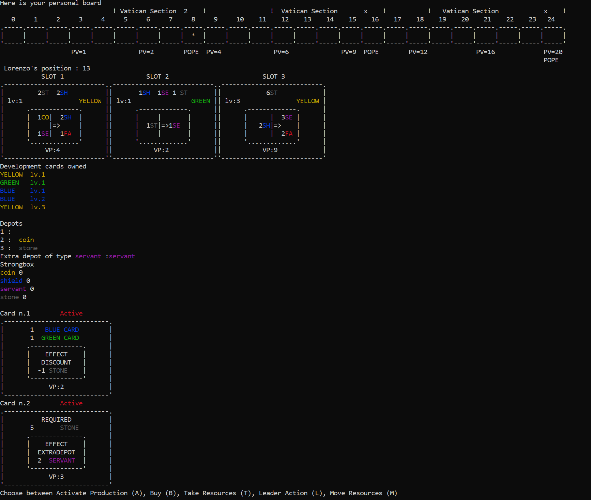
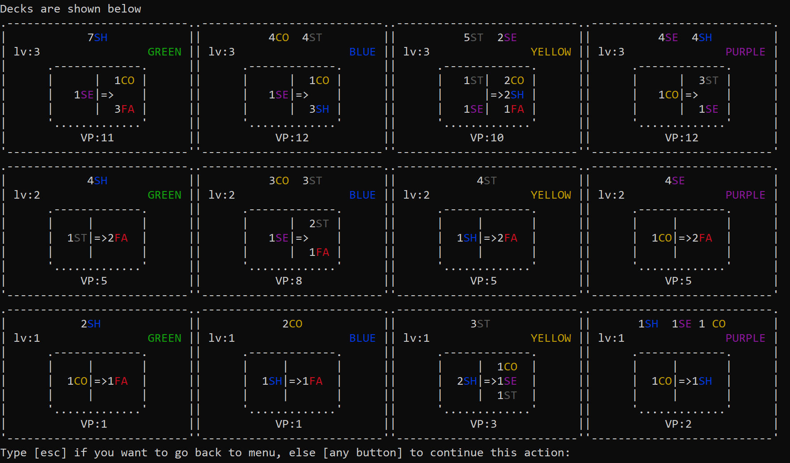

# Masters of Renaissance
**Final project of "Software Engineering" AY 2020-2021.**

**Professor**: Prof. Gianpaolo Cugola

**Group**: GC15

#### Team Members:
* [Domenico Putignano](https://github.com/domenicoputignano) 
* [Piero Rendina](https://github.com/PieroRendina) 
* [Andrea Restelli](https://github.com/andrearestelli)

## Implemented features
| Feature | Status |
| ------- | ------ |
| Complete rules | :heavy_check_mark: |
| Socket | :heavy_check_mark: |
| CLI | :heavy_check_mark: |
| GUI | :heavy_check_mark: |
| Multiple matches | :heavy_check_mark: |
| Disconnection resilience | :heavy_check_mark: |
| Local game | :heavy_check_mark: | 

## Requirements
* [Java SE 11 or higher](https://docs.oracle.com/en/java/javase/11/)
* [Maven (optional)](https://maven.apache.org/download.cgi)

## Build
You can skip this phase by [running](#Run) the JAR placed in [`/deliverables`](/deliverables) folder.

In order to build the JAR, you have to:
1. Install [Maven](https://maven.apache.org/download.cgi)
2. Clone this repository
3. In the cloned folder, run:
```bash
mvn package
```
4. The compiled artifact (`MaestriDelRinascimento.jar`) will be inside the `target` folder.

## Run
### Server
To run the server, type:
```bash
java -jar MaestriDelRinascimento.jar server
```


#### Options
If you want to edit some options, you can write them at the end of the previous command.
The options available for the server are listed below.

```bash
java -jar MaestriDelRinascimento.jar server -port:Y
```

| Option | Description | Default value | 
| ------ | ----- | ----- |
| `-port:` | The port the server is listening on. | 1234 |
### Client
The game can be played with a GUI or through a CLI, you can choose what best fits your taste! <br>
Furthermore you can play in solo mode on your local machine without connecting to the server.
### GUI :video_game:
To run the GUI, type:
```bash
java -jar MaestriDelRinascimento.jar gui
```

 

### CLI :space_invader:
First of all, if you are on Windows, run this command to allow the game to use ANSI codes to show its colorful CLI interface:
```
REG ADD HKCU\CONSOLE /f /v VirtualTerminalLevel /t REG_DWORD /d 1
```

Then to run the CLI, type:
```bash
java -jar MaestriDelRinascimento.jar cli
```
 


#### Options
If you want to edit some options, you can write them at the end of the previous commands.
The options available for the client are listed below.

```bash
java -jar MaestriDelRinascimento.jar gui -ip:X.X.X.X -port:Y
```

| Option | Description | Default value | 
| ------ | ----- | ----- |
| `-ip:` | The ip of the server the client has to connect to | 127.0.0.1 |
| `-port:` | The port the server is listening on. | 1234 |

### Local game :computer:
To start a solo mode game without connecting to the server, type:
```bash
java -jar MaestriDelRinascimento.jar local
```
By default, the client is started with GUI.
To play with CLI, type:
```bash
java -jar MaestriDelRinascimento.jar local cli
```
## Test coverage details
Unit tests have been performed mainly on Model and Controller components, since Client and Network would 
have been difficult to test through the technologies used. Testing tools mainly used in this project are 
[JUnit](https://junit.org/junit5/) and [Mockito](https://site.mockito.org/). <br>
The coverage results achieved for Model and Controller packages are shown below.


#### To run the tests, you can run this command:
```
mvn test
```


